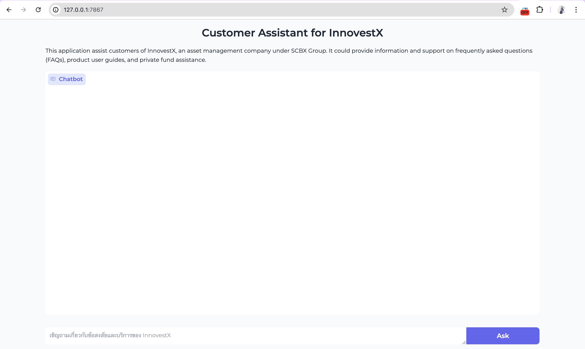

## 1. Setup for Mac
1. Create virtual environment
```bash
python3 -m venv your_venv
source your_venv/bin/activate
pip install -r requirements.txt
```
2. Insert Credentials
open config.py and provide your OPENAI_API_KEY
```python
OPENAI_API_KEY = 'your_openai_api_key_here'
```
## 2. Create vector database using Chroma
1. Follow the step in create_vectorstore.ipynb (uncommented code in Part2: Extract information from image if you want to regenerate the dataframe)

2. After run all cell, a vectorstore name "innovestx_db" will be created.

## 3. Run Project.
To use text-text chatbot please put this command in terminal.
```bash
python3 src/rag/chatbot.py
```

You should see interface like this:



